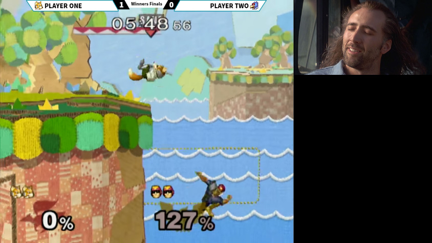
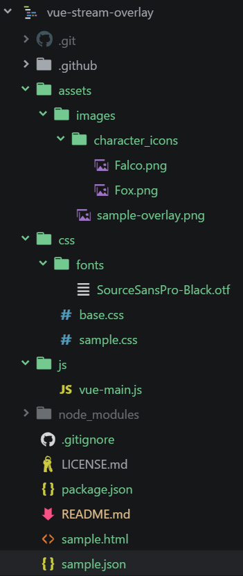
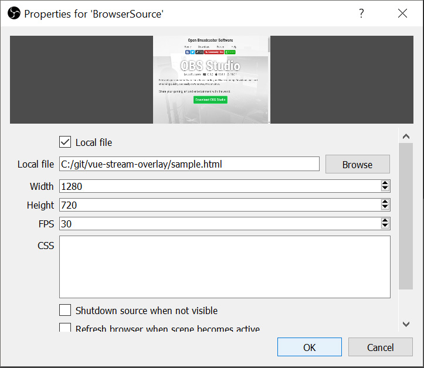

## Creating Stream Overlays with Vue.js


### Project Structure
  

- **[sample.html](sample.html)** is our production file. It's what you'll add to obs/xsplit and what displays all our information.  
- **[sample.json](sample.json)** is our data source. This can come from whatever program you're comfortable with, [StreamControl](http://farpnut.net/StreamControl) is a common example.  
- **[js/vue-main.js](js/vue-main.js)** holds our Vue.js logic to load sample.json and inject the information to sample.html  
- **[assets/](assets)** is where we'll put our images and other necessary files.  
- **[css/](css)** is for all our CSS needs and also contains our fonts.

### JS
```js
let POLL_INTERVAL = 2500;
let JSON_PATH = './sample.json';

let app = new Vue({
  el: '#app',
  data: {
    info: {}
  },
  methods: {
    async loadJSON(filePath) {
      const resp = await axios.get(filePath, { responseType: 'json' });
      this.info = resp.data;
    }
  },
  // Triggered when the vue instance is created, triggers the initial load.
  created: function() {
    this.loadJSON(JSON_PATH);
    setInterval(() => { this.loadJSON(JSON_PATH); }, POLL_INTERVAL);
  }
});
```
The actual javascript is so short when using Vue.js that we can just talk about it in one chunk. At the top I have some variables for ease of access, note that the path is relative to sample.html (where this file is run from).  
Then we define a new `Vue` object, and tell it to look for the DOM element `#app`. We set a default value for `info` and define a method for loading our json data and assigning it to `info`.  
From there it's a matter of calling our method at an interval so that our Vue data is up to date.

### HTML
Vue.js allows us to bind to the DOM, so using our script that loads from sample.json we can bind variables directly to the visible content.  
```html
<div class="p1-score container">
  <transition name="fade" mode="out-in">
    <span class="score" :key="info.p1_score" v-html="info.p1_score"></span>
  </transition>
</div>
```
Vue.js supports a number of syntaxes (including Mustache), so your usage may vary. I've taken a liking to using `v-html` simply because I want the flexibility to be able to inject HTML on the fly.  
A quirk with Vue.js is that transitions do not recognize plain text changes. Therefore we need to change some DOM attribute in order for it to pick that up. Vue projects `:key` for that exact reason. So whenever our value changes, it alters `:key:` and triggers the transition.  
_[(Read more about transitions on the Vue.js website)](https://vuejs.org/v2/guide/transitions.html)_

### CSS
Our CSS defines where on the screen we want our text. You could spend all day building a fancy website properly, or you could simply hack stuff into place with absolute positioning because this is a controlled environment that won't be changing.  
```css
.p1-char {
  top: 4px;
  left: 102px;
  width: 25px;
}
```
In [css/sample.css](css/sample.css) you can see this in action. As I'm manually setting where we want our text on the screen by drawing boxes relative to the top left corner. We're using `flex` for centering.

### Adding to OBS
  
Add a new BrowserSource in OBS, and point it to our local sample.html file. Set the Width/Height and FPS based on your needs.  
